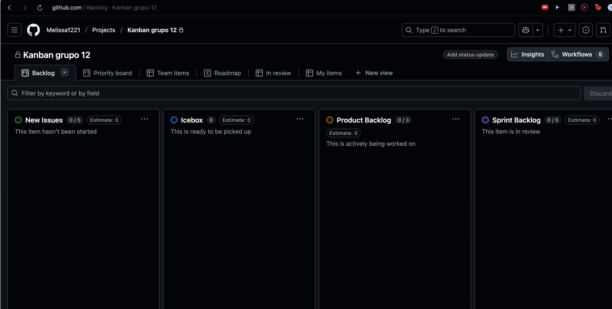
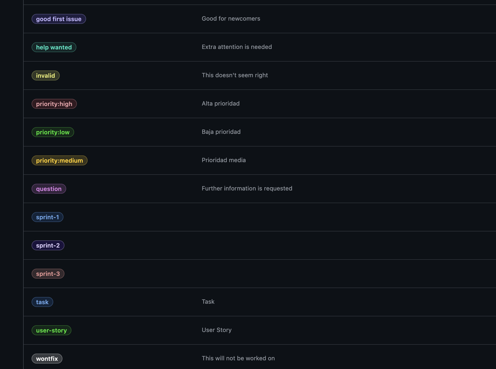
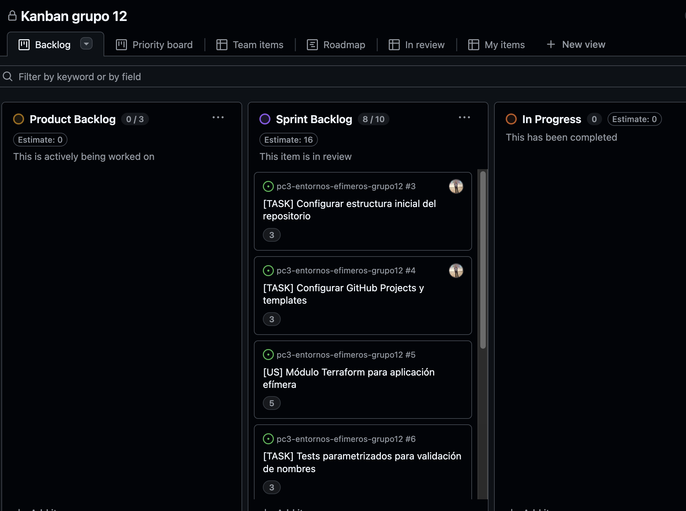

# Avance Sprint 1 - Días 1, 2 y 3

**Sprint:** 1
**Período:** 30/10/2024 - 01/11/2024
**Equipo:** Melissa, Amir, Diego

## Tareas Completadas

### 1. Configuración del Repositorio

Repositorio creado: `Melissa1221/pc3-entornos-efimeros-grupo12`

Estructura de carpetas implementada:
- src/
- tests/ (unit, integration, e2e)
- infra/terraform/ (modules, stacks)
- .github/workflows/
- docs/
- evidence/ (sprint-1, sprint-2, sprint-3)

Archivo .gitignore configurado con:
- .terraform/
- *.tfstate
- *.tfstate.backup
- tfplan
- .env
- __pycache__/
- .pytest_cache/
- htmlcov/
- .coverage

Ramas creadas:
- main
- develop
- feature/melissa

### 2. GitHub Projects Setup

Tablero Kanban configurado con columnas:
New Issues → Icebox → Product Backlog → Sprint Backlog → In Progress → Review-QA → Done

Custom fields configurados:
- Estimate (número): para story points
- blocked_time (número): tiempo bloqueado en minutos
- trend (selección): mejora/empeora/estable

Labels creados:
- priority:high, priority:medium, priority:low
- sprint-1, sprint-2, sprint-3
- user-story, task, bug

Product Backlog creado:
19 issues distribuidos en 3 sprints
Total: 61 story points

### 3. Templates de GitHub

Templates creados:
- .github/pull_request_template.md
- .github/ISSUE_TEMPLATE/user_story.md
- .github/ISSUE_TEMPLATE/bug_report.md
- .github/ISSUE_TEMPLATE/task.md
- .github/ISSUE_TEMPLATE/config.yml

### 4. Documentación Inicial

Documentos creados:
- docs/setup.md (configuración del entorno)
- README.md (objetivos del proyecto)
- docs/arquitectura.md (decisiones de patrones DIP/Composite/Builder)

## Métricas

**Story Points:** 9 pts asignados para Day 1
**Tiempo invertido:** 6h
**Blocked time:** 0 minutos

## Issues del Sprint 1 Listos para Desarrollo

- #3: Configurar estructura inicial del repositorio (3 pts) - COMPLETADO
- #4: Configurar GitHub Projects y templates (3 pts) - COMPLETADO
- #5: Módulo Terraform para aplicación efímera (5 pts) - Pendiente
- #6: Tests parametrizados para validación de nombres (3 pts) - Pendiente
- #7: Setup pytest con fixtures y conftest (2 pts) - Pendiente
- #8: Tests de idempotencia de Terraform (3 pts) - Pendiente
- #9: Crear Makefile con targets para IaC y testing (3 pts) - Pendiente
- #10: Recopilar evidencias del Sprint 1 (2 pts) - Pendiente

---

# Avance Day 2 - Amir

**Fecha:** [Fecha del día 2]
**Sprint:** 1
**Responsible:** Amir

## Tareas Completadas

### 1. Módulo Terraform - Ephemeral App

Módulo creado en: `infra/terraform/modules/ephemeral-app/`

Archivos implementados:
- main.tf: Recurso Docker container con naming dinámico basado en pr_number
- variables.tf: Variable pr_number con validación (debe ser > 0)
- outputs.tf: URL local del app
- README.md: Documentación del módulo

Características:
- Naming único: `ephemeral-pr-{number}-app`
- Puerto dinámico: `app_port + (pr_number % 100)`
- Labels para identificación de PR y entorno

### 2. Stack Base con PR Number

Stack creado en: `infra/terraform/stacks/pr-preview/`

Archivos:
- main.tf: Invoca módulo ephemeral-app con pr_number
- variables.tf: Variable pr_number como parámetro principal

### 3. Configuración de Validación IaC

Archivos de configuración:
- infra/terraform/.tflint.hcl: Plugin terraform con preset recommended
- docs/iac-validation.md: Documentación de comandos de validación

### 4. Tests Unitarios de Naming

Archivo creado: `tests/unit/test_naming.py`

Tests implementados:
- test_stack_naming_validation: Parametrizado con 8 casos (PR válidos e inválidos)
- test_generate_stack_name: Verifica generación correcta de nombres
- test_stack_name_uniqueness: Valida que diferentes PRs generan nombres únicos

Función creada: `src/validators.py`
- validate_pr_number(): Valida que PR sea entero positivo
- generate_stack_name(): Genera nombre ephemeral-pr-{number}

### 5. Documentación de Módulos

Documentos actualizados:
- docs/arquitectura.md: Diagrama de módulos
- docs/iac-validation.md: Pipeline de validación IaC

## Métricas

**Story Points:** 11 pts (issues #5 y #6)
**Tiempo invertido:** 7h
**Blocked time:** 0 minutos

## Issues Completados

- #5: Módulo Terraform para aplicación efímera (5 pts) - COMPLETADO
- #6: Tests parametrizados para validación de nombres (3 pts) - COMPLETADO

## Observaciones

Sin bloqueos. Módulo base de Terraform funcionando correctamente con validaciones.

---

# Avance Day 3 - Diego

**Fecha:** 01/11/2024
**Sprint:** 1
**Responsible:** Diego

## Tareas Completadas

### 1. Configuración de pytest

Archivos creados:

**tests/conftest.py:**
- Fixture `terraform_provisioner`: Mock con autospec de TerraformProvisioner
- Fixture `pr_environment`: Configura environment de PR con monkeypatch
- Fixture `cleanup_resources`: Autouse para limpieza después de tests

**pytest.ini:**
- Configuración de testpaths, naming patterns
- Markers: unit, integration, e2e
- Addopts: coverage con reports en terminal y HTML

### 2. Tests de Idempotencia

Archivos creados:

**src/provisioner.py:**
- Clase base TerraformProvisioner siguiendo patrón DIP
- Métodos: apply(), destroy(), get_state(), plan()

**tests/unit/test_idempotency.py:**
- test_terraform_apply_idempotent: Verifica que 2 applies dan mismo resultado
- test_multiple_applies_same_state: Parametrizado para 1, 2, 3 applies
- test_terraform_with_config_override: Usa patch.dict para configuración

Características:
- Usa autospec del fixture terraform_provisioner
- Verifica con call_args_list
- Implementa patch.dict para casos de configuración

### 3. Makefile Completo

Archivo creado: `Makefile`

Targets implementados:
- **help**: Muestra ayuda con comandos disponibles
- **tools**: Verifica terraform, tflint, tfsec, pytest instalados
- **test**: Ejecuta pytest con cobertura ≥90%
- **lint**: Linters Python (black, flake8) y Terraform (fmt)
- **plan**: Pipeline IaC completo (fmt → validate → tflint → tfsec → plan)
- **apply**: Aplica plan de Terraform
- **destroy**: Destruye stack con auto-approve
- **clean**: Limpia archivos temporales

Variables configurables:
- TERRAFORM_DIR: Ruta al stack de Terraform
- PR_NUMBER: Número de PR (default: 1)

### 4. Evidencias Sprint 1

Archivos actualizados:
- evidence/sprint-1/avance-sprint1.md: Este archivo con avances de los 3 días

Pendiente capturar:
- Status filtrado por Done
- Sum(Estimate) por Status
- Burndown chart (si disponible)

## Métricas

**Story Points:** 8 pts (issues #7, #8, #9)
**Tiempo invertido:** 5h
**Blocked time:** 0 minutos

## Issues Completados

- #7: Setup pytest con fixtures y conftest (2 pts) - COMPLETADO
- #8: Tests de idempotencia de Terraform (3 pts) - COMPLETADO
- #9: Crear Makefile con targets para IaC y testing (3 pts) - COMPLETADO

## Observaciones

Sin bloqueos. Sistema de testing configurado y Makefile listo para automatización.
Issue #10 (Recopilar evidencias) se completará con capturas de GitHub Projects.

---

## Resumen Sprint 1 (Días 1-3)

### Story Points Completados
- Día 1 (Melissa): 6 pts (#3, #4)
- Día 2 (Amir): 8 pts (#5, #6)
- Día 3 (Diego): 8 pts (#7, #8, #9)
- **Total: 22 pts de 24 pts** (92% completado)

### Pendiente
- #10: Recopilar evidencias del Sprint 1 (2 pts) - EN PROGRESO
  - Capturas de GitHub Projects
  - daily-standup.md
  - review-retro.md

### Archivos Creados en Sprint 1
- 7 archivos de configuración y templates (Día 1)
- 4 documentos técnicos (Día 1)
- 1 módulo Terraform completo (Día 2)
- 2 archivos de tests de naming (Día 2)
- 3 archivos de configuración pytest (Día 3)
- 2 archivos de tests de idempotencia (Día 3)
- 1 Makefile con 8 targets (Día 3)

### Métricas Generales
- **Velocity promedio:** 7.3 pts/día
- **Blocked time total:** 0 minutos
- **Issues completados:** 7 de 8
- **Cobertura de tests:** Pendiente medir (objetivo: ≥90% en Sprint 2)
